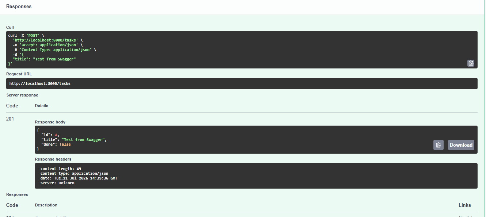
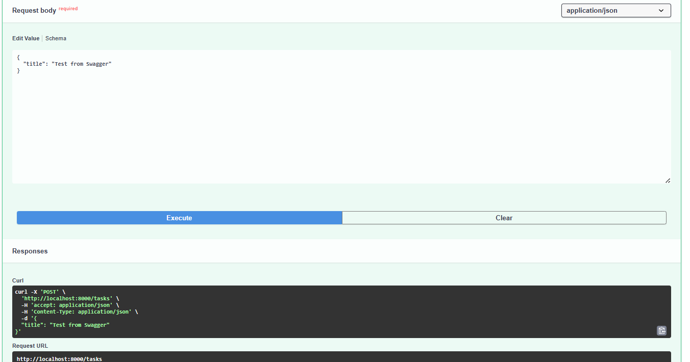

# Task API

A simple CRUD API for managing a to-do list, built with FastAPI as part of the FlyRank Internship — Backend Track.

## What this is

A small REST API that lets you create, read, update, and delete tasks. Originally built with in-memory storage (Week 2), now backed by a real SQLite database (Week 3) — so data survives a server restart.

## Why SQLite

SQLite was chosen because it's a single file with zero setup — no separate database server to install or run. It's perfect for a small project like this: the whole database is just `tasks.db`, created automatically the first time the app runs.

## Where the database lives

The database file `tasks.db` is created automatically in the project folder the first time you run the app. It is git-ignored, so every fresh clone starts with a brand new, empty-then-seeded database rather than inheriting anyone else's data.

## How to run it

1. Clone this repo and enter the folder:
```
   git clone https://github.com/Habibahesham02/todo-api.git
   cd todo-api
```
2. Create and activate a virtual environment:
```
   python -m venv venv
   venv\Scripts\Activate.ps1
```
3. Install dependencies:
```
   pip install fastapi uvicorn
```
4. Run the server:
```
   uvicorn main:app --reload
```
5. Visit `http://localhost:8000` in your browser, or `http://localhost:8000/docs` for Swagger UI.

On first run, `tasks.db` is created automatically with the `tasks` table and 3 seeded example tasks.

## Endpoints

| Method | Path            | Description                          |
|--------|-----------------|----------------------------------------|
| GET    | `/`             | API info                              |
| GET    | `/health`       | Health check                          |
| GET    | `/tasks`        | List all tasks                        |
| GET    | `/tasks/{id}`   | Get a single task (404 if missing)    |
| POST   | `/tasks`        | Create a task (400 if title missing)  |
| PUT    | `/tasks/{id}`   | Update a task (404 if missing)        |
| DELETE | `/tasks/{id}`   | Delete a task (204, 404 if missing)   |

## Example request

```
curl -i -X POST http://localhost:8000/tasks -H "Content-Type: application/json" -d "@task.json"

HTTP/1.1 201 Created
content-type: application/json

{"id":4,"title":"Buy milk","done":false}
```

## Swagger UI

Interactive docs are available at `/docs`. Example of a successful `POST /tasks` request:




## Exploring the database directly

Opened `tasks.db` in DB Browser for SQLite and ran:

```sql
SELECT * FROM tasks WHERE done = 1;
```

This returned 1 row — task id 6, "Walk the dog" — demonstrating that filtering by status happens inside the database itself, rather than in a loop in the application code.


## Persistence

Unlike the original in-memory version, tasks now survive a server restart because they're stored in `tasks.db` on disk rather than in a variable in memory. Restarting the server, running `GET /tasks`, and seeing previously created tasks still present is the proof.

## Notes

All CRUD operations use parameterized SQL queries (`?` placeholders) rather than gluing user input directly into SQL strings, to keep the database safe from injection.